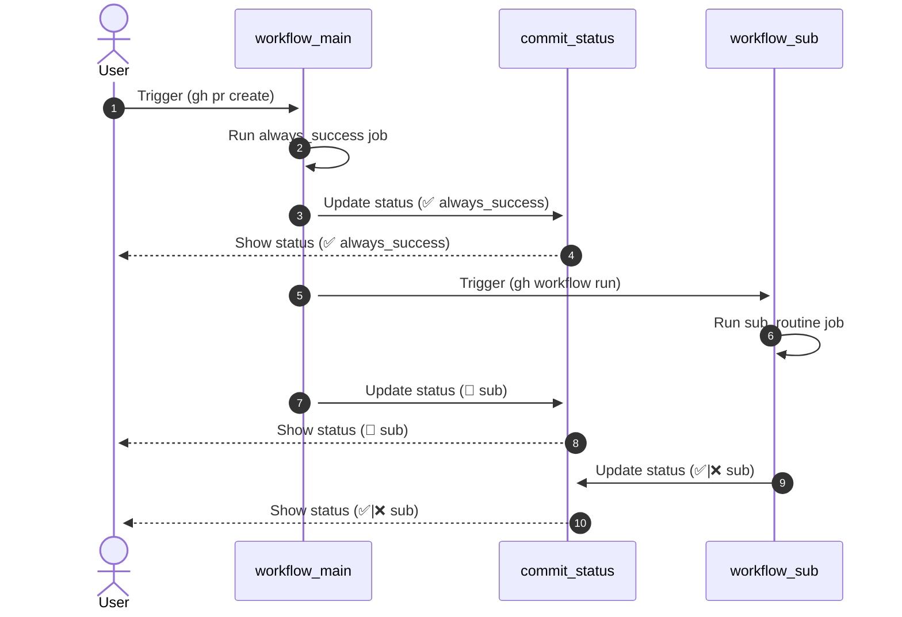

# 概要
本記事は、[GitHub Actions Advent Calendar 2023](https://qiita.com/advent-calendar/2023/github-actions) の 18日目の記事です。

GitHub の Pull Request にある status checks (commit status)[^status_check] ですが、REST API を使って値が設定できることを最近知りました。

https://docs.github.com/ja/rest/commits/statuses?apiVersion=2022-11-28

また、 workflow_call (他のワークフローから呼び出すことを許可するトリガー) を指定し、呼び出した場合、 **commit status は適切に作成、更新される**ようです。

「では、**workflow_call を使わず**に別のワークフローを呼び出した場合[^case]にも、上記の API をたたけば、適切に commit status を作成、更新することは可能なんじゃないか？」

と思いつき、実際にやったらできた🥰、という記事になります。

以下では、workflow_dispatch を使って別のワークフローを呼び出し、適切に commit status を作成、更新する例を紹介します。

# シーケンス図
今回作成したサンプルは、以下の流れとなっています
1. PR 作成によって、main.yaml がトリガーされる
2. main.yaml の中で 本体の処理 always_success が実行される
3. always_success の commit status (status checks) が更新される
4. always_success の commit status (status checks) が表示される
5. main.yaml の中で sub.yaml を workflow_dispatch でトリガーさせる
6. sub.yaml の中で sub_routine が実行される
7. main.yaml の中で sub.yaml の commit staus を sub (🏃pending) として新規作成する
8. sub の commit status (status checks) が表示される
9. トリガーされた sub.yaml の本体の処理 sub_routine が完了した後、 commit status を sub_routine の結果に応じて[^fix_result]更新し、完了する
10. sub の commit status (status checks) が表示される



概ねシーケンス図の通りですが要点をまとめると、
- main 側で sub workflow を起動
- main 側で sub workflow の status を新規作成 (pending)
- sub 側で sub workflow の status を更新 (success/failure)

となります。

# 結果
作成したサンプルの PR status check は以下です。


`sub workflow -- called by main` とあるのが、今回作成した commit status になります。
  - 比較のため workflow_call を使ったジョブ `main workflow / call_sub_by_call_workflow` も載せています。 やはり workflow_call では、job 名、トリガーイベント、処理時間まで自動で追加されるし、summary にはジョブの結果まであるので、とても見やすいですね 🫠

# 躓いた点
以下では、ソースコードを交えながら躓いた点を説明します。
https://github.com/rokkish/sync_status_check/tree/main/.github/workflows

## 呼び出し側
https://github.com/rokkish/sync_status_check/blob/main/.github/workflows/main.yaml

### permissions - 適切な権限設定
actions のデフォルト権限は読み取りのみとなっています。なので、適切な権限を把握し、最小権限を付与してあげる必要があります。


今回必要となる権限は、ワークフローの実行と status の作成です。
よって、以下のように設定すると良いです。
```yaml:main.yaml
permissions:
  actions: write
  statuses: write
```

権限設定に関するドキュメントは以下を参照してください。
#### Create a workflow dispatch event
> You must authenticate using an access token with the repo scope to use this endpoint. GitHub Apps must have the actions:write permission to use this endpoint.

https://docs.github.com/ja/rest/actions/workflows?apiVersion=2022-11-28#create-a-workflow-dispatch-event

#### Repository permissions for "Commit statuses"
https://docs.github.com/en/rest/authentication/permissions-required-for-github-apps?apiVersion=2022-11-28#repository-permissions-for-commit-statuses

#### 余談
上記の権限設定をした状態で job のコンテキストをダンプすると、最低限の情報しか出力されていないことが確認できました🥰
```yaml:main.yaml
    steps:
      - name: Dump job context
        env:
          JOB_CONTEXT: ${{ toJson(job) }}
        run: |
          echo "$JOB_CONTEXT"
```
```console:echo "$JOB_CONTEXT"
{
  "status": "success"
}
```
### actions/checkout - デフォルトの状態と必要な設定
:::message
main ブランチへ feat ブランチをマージするためのPRを作成したという状況を想定しています
:::
Pull Request イベントでトリガーされたワークフローにおいて、actions/checkout で checkout されるデフォルトの状態（HEAD）は、`refs/pull/x/merge` となっています。つまりマージコミット上にいます。

```sh:output of git log
# actions/checkout した後で以下を実行する 
$ git log --oneline --graph --decorate --all

*   0a1c82e (HEAD, pull/1/merge) Merge 28806442437eecc9b99ef9995fb6ec787afb489a into 91cc053f09bd8c552742126cd2834775ec590c5d
|\  
| * 2880644 (grafted) Add main and sub workflows for status synchronization
* 91cc053 (grafted) init
```

一方で、今回 commit status を付与したい commit はマージコミット(`0a1c82e`)ではなく、 push された feat ブランチの最新コミット[^is_latest] (`2880644`)です。

actions/checkout にて ref を feat ブランチに指定することで、 commi status を付与したいコミットハッシュを取得できるはずです。

#### actions/checkout にて ref を指定しないで解決する方法
ちなみに、 ref を変えずに欲しいコミットハッシュを得る方法もあります。

マージコミット上で、`git rev-parse HEAD^2` として、二番目の親ブランチのコミットハッシュを取得することが可能です。
```sh:main.yaml
# current ref is merge commit
# HEAD^2 means the second parent of HEAD
# https://git-scm.com/docs/git-rev-parse#Documentation/git-rev-parse.txt-emltrevgtltngtemegemHEADv1510em
latest_main_run_commit_hash=$(git rev-parse HEAD^2)
```
https://git-scm.com/docs/git-rev-parse#Documentation/git-rev-parse.txt-emltrevgtltngtemegemHEADv1510em

と思いきや、以下のエラーで怒られてしまいます。
```console
fatal: ambiguous argument 'HEAD^2': unknown revision or path not in the working tree.
```
これは actions/checkout の fetch-depth がデフォルト 1、つまりマージコミット分だけ歴史を取得しているためです。

よって、2 以上の値を設定してあげると、feat ブランチの最新コミット(`2880644`)を取得することができます。
```yaml
      - uses: actions/checkout@v4
        with:
          fetch-depth: 2
          # In actions/checkout, fetch-depth: 2 is required
          # if not, HEAD^2 is not available
          # --> fatal: ambiguous argument 'HEAD^2': unknown revision or path not in the working tree.
```
## 呼び出される側
呼び出される側については、特に躓くことなく実装できた[^help_gpt]ため、省略します 🙃

気になる方は、以下を参照してください👍
https://github.com/rokkish/sync_status_check/blob/main/.github/workflows/sub.yaml
# まとめ
本記事では、workflow_dispatch を使って別のワークフローを呼び出し、適切に commit status を作成、更新する例を紹介しました。

本記事作成にあたり、シーケンス図を書いたことで、sub_routine が起動しなかったら状態がずっとpending になってまずいなー🧐、という点に気づけました。

その他、ツッコミ、ご指摘有りましたら、コメントしていただければ幸いです 🙌

# 参考記事
使用したアクション
https://github.com/actions/checkout

git rev parse 関連
https://git-scm.com/docs/git-rev-parse#Documentation/git-rev-parse.txt-emltrevgtltngtemegemHEADv1510em

permission 関連
https://docs.github.com/en/actions/using-jobs/assigning-permissions-to-jobs#overview

mermaid 関連
https://zenn.dev/yuriemori/articles/e097dbd950df86

[^status_check]: 本記事では、status checksと commit status の使い分けが怪しい点があります🙇 ドキュメントを見るに、[status checks](https://docs.github.com/ja/pull-requests/collaborating-with-pull-requests/collaborating-on-repositories-with-code-quality-features/about-status-checks) は PR の文脈で使用され、[commit status](https://docs.github.com/ja/rest/commits/statuses?apiVersion=2022-11-28) は REST API の文脈で使用されるという点が異なっていると理解しました。

[^case]: そんな状況ある？となりますが、元の PR の状態に影響を与えるワークフローを呼び出す状況などが考えられます。

[^fix_result]: 今回は常に成功するように設定しています。

[^is_latest]: 話が複雑になるのを避けるため、本記事では concurrency をワークフロー単位で設定することで、最新コミットでしかワークフローが実行されないことを前提としています。

[^help_gpt]: 概ね、GitHub Copilot ✈️ さんに補完してもらいました✌️
